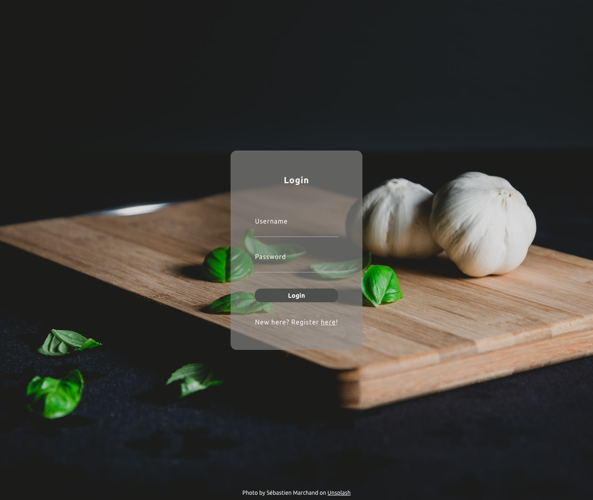
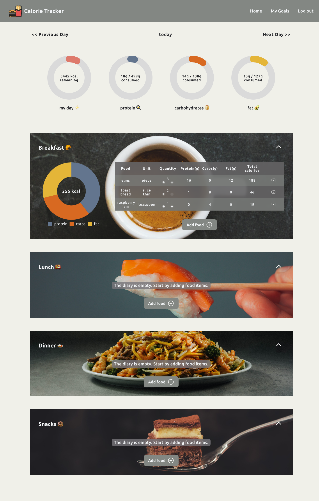
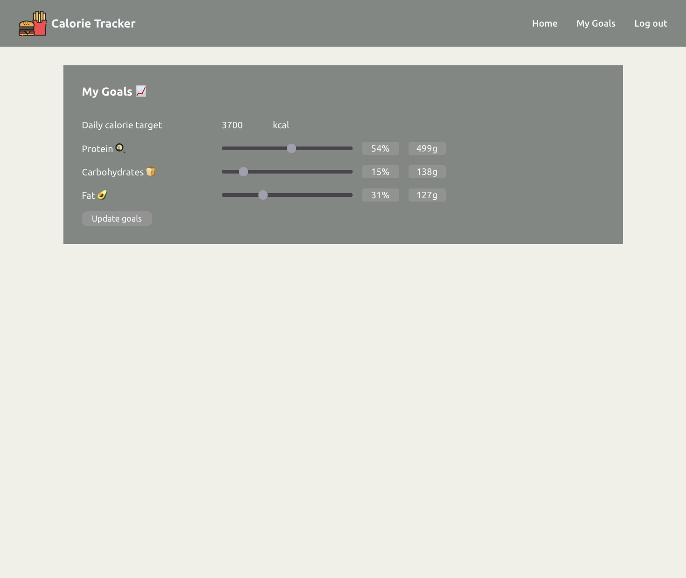

# Calorie Tracker

This app allows an user to set their macronutrient goals and log their daily calorie intake by searching for ingredients provided by a third-party food database. [Spoonacular](https://spoonacular.com/)'s ingredient search and autocomplete api are used in this project.

Technologies used

- Node.js
- React.js
- Redux
- MongoDB

Screenshots

Credits

- Unplash photos
  - [Luc Bercoth](https://unsplash.com/photos/REPQln8St2E)
  - [Jordane Mathieu](https://unsplash.com/photos/k7VgPnWFcx8)
  - [Douglas Lopez](https://unsplash.com/photos/LlPLQGgYuio)
  - [Matt Hoffman](https://unsplash.com/photos/IE-gdqEg45M)
  - [Sébastien Marchand](https://unsplash.com/photos/oVIUvwm2dvM)
- Icons
  - [SVG repo](https://www.svgrepo.com/)
